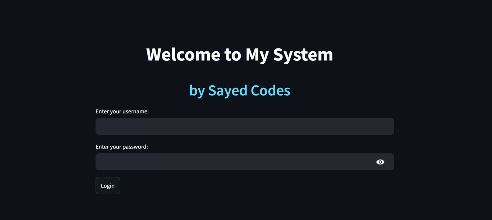

# 🤖 AI Assistant

An AI-powered web application built with **Python** and **Streamlit** that provides an interactive chatbot experience using modern AI capabilities.

## 🌐 Live Demo

🔗 **Live App:** https://ai-sayedhamza.streamlit.app/

## 📂 GitHub Repository

🔗 **Repository:** https://github.com/Sayedcodes/AI

---

## ✨ Features

* 💬 Interactive AI chatbot
* ⚡ Fast and responsive Streamlit interface
* 🎯 Clean and minimal UI
* 🧠 AI-powered responses
* 📱 Responsive design
* ☁️ Easy deployment on Streamlit Cloud

---

## 🛠️ Tech Stack

* Python
* Streamlit
* OpenAI API (or your AI provider)
* Git
* GitHub

---

## 📸 Preview

> Add a screenshot of your application here.

Example:

```
images/screenshot.png
```

Then use:

```md

```

---

## 🚀 Installation

Clone the repository:

```bash
git clone https://github.com/Sayedcodes/AI.git
```

Go to the project folder:

```bash
cd AI
```

Install dependencies:

```bash
pip install -r requirements.txt
```

Run the application:

```bash
streamlit run app.py
```

---

## 📁 Project Structure

```
AI/
│
├── app.py
├── requirements.txt
├── README.md
└── assets/
```

*(Structure may vary depending on your project.)*

---

## 🎯 Future Improvements

* Conversation history
* Multiple AI models
* Dark/Light theme toggle
* Voice input
* File upload support
* Better prompt engineering

---

## 👨‍💻 Author

**Sayed Hamza**

* GitHub: https://github.com/Sayedcodes
* LinkedIn: https://in.linkedin.com/in/sayed-hamza

---

## ⭐ Support

If you found this project helpful, consider giving it a **⭐ Star** on GitHub. It helps and motivates me to build more awesome projects.

---

## 📜 License

This project is intended for learning and portfolio purposes.
